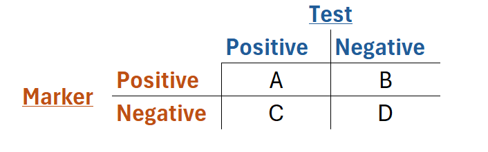

## Overview

In a [prior article](https://formedstudents.netlify.app/applications/8_sensitivity%20and%20specificity/) Sensitivity and specificity were defined, and these go hand in hand with two other important metrics - Positive and Negative predicted value (PPV and NPV)

The goal of this post is to clearly define PPV and NPV with some basic examples to help you get your head around them.

## The Set Up - same as for Sensitivity and Specificity

The core idea is that a test (like a blood test, physical exam maneuver, etc.) is not perfect, and will not catch every result. So when using tests in practice we must be able to compare their performance and have a good idea of when they are helpful or not.

Lets start with a scenario - you have a blood test for a given marker. There are four quantities that you are concerned with, that can be summarized into the below "2 by 2" table.

-   A is the number of people who are positive for both the marker and the test, **True Positives**
-   B is the number of people who have the marker but tested negative, **False Negatives**
-   C is the number of people who have a positive test but no marker, **False Positives**
-   D is the number of people who have a negative test and no marker, **True Negatives**

## Definitions

OK so now we have context. Let's define Positive and negative predictive value.

Note that when we talk about sensitivity and specificity, we are concerned with the populations that do or do not have the marker and how well the test does in recognizing them.

For PPV and NPV, the frame of reference is slightly different - we are considering the groups that test positive and negative, as opposed to the groups that do or do not have the marker.

------------------------------------------------------------------------

**Positive Predictive Value (PPV)** is defined as the chance that someone actually has the marker if they have a positive test.

*Essentially, if the test is positive, what is the chance that the person actually has it*

$$
PPV = \frac{A}{A+C} = \frac{True Positives}{True Positives + False Positives}
$$

------------------------------------------------------------------------

**Negative Predictive Value (NPV)** is defined as the chance that someone actually **does not** have the marker if they have a negative test.

*Essentially, if the test is negative, what is the chance that the person actually does not have it*

$$
NPV = \frac{D}{B+D} = \frac{True Negatives}{True Negatives + False Negatives}
$$

### An Example

We have a test for a disease which has a PPV of 90%, and we test 100 people.

If 50 of them test positive, how many of these actually have the disease?

**Answer** With 50 positive tests and a PPV of 90% we can calculate true positives as below

$$
PPV = \frac{True Positives}{True Positives + False Positives} = \frac{True Positives}{All Test Positive Results}
$$ $$
0.9 = \frac{True Positives}{50 people}
$$ $$
0.90 * 50 people  = True Positives
$$ $$
True Positives = 45 people
$$

## Thank you!

Thanks for reading through this article. More articles connecting clinical practice and mathematics are coming soon.
